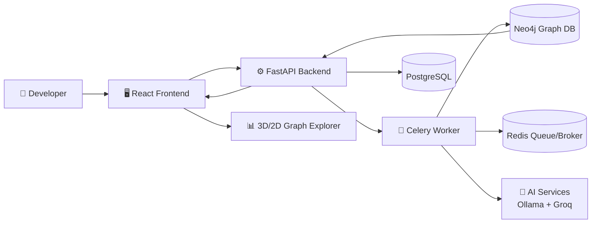
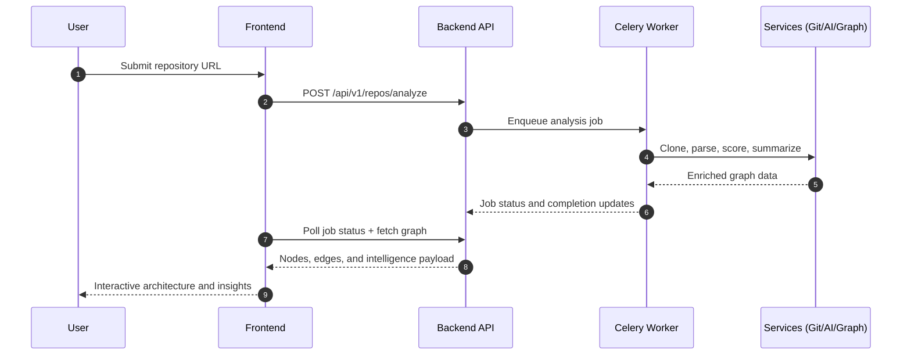
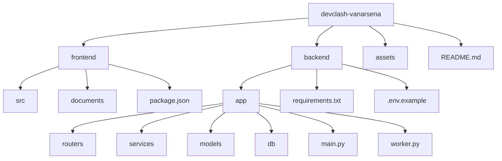

# CodeMap 🛰️
CodeMap is a developer intelligence platform that turns any GitHub repository into an interactive architecture map with AI-powered insights.  
It replaces slow manual codebase exploration with a visual, guided, and explainable analysis workflow.

---
## Problem Statement
Developers, reviewers, and hackathon teams often struggle with understanding unfamiliar codebases quickly.  
CodeMap solves this by enabling:
- visual dependency exploration in 3D
- real-time repository analysis progress tracking
- AI-assisted node-level code understanding

---
## Solution Overview
CodeMap combines:
- a **React + Three.js frontend layer** for immersive architecture exploration and workflow navigation
- a **FastAPI + Celery backend layer** for repository ingestion, parsing, orchestration, and APIs
- a **PostgreSQL + Neo4j + Redis + AI integration layer** for job tracking, graph intelligence, queueing, and LLM-powered enrichment
This delivers faster onboarding, clearer architecture decisions, and better engineering collaboration.

---
## Architecture (Visual Representation)

---
## Repository Analysis Flow (Visual Representation)

---
## Tech Stack 🧰
| Layer | Technology | Purpose |
|---|---|---|
| Frontend | React, TypeScript, Vite | Build fast, interactive product UI |
| Styling | Tailwind CSS, Framer Motion | Deliver modern visual system and motion |
| Data/State | Zustand, React Router | Manage global state and app navigation |
| Backend | FastAPI, SQLAlchemy, Pydantic | Serve APIs, schemas, and async data access |
| Core Engine/Logic | Celery, Tree-sitter, GitPython | Run background analysis and code intelligence |
| Tooling | Redis, PostgreSQL, Neo4j, Ollama, Groq | Queue jobs, persist data, and power AI insights |

---
## Project Structure (Architecture View) 🏗

---

## Key Features
- **Smart Repository Analysis:** Analyze any public repository with an asynchronous, production-style job pipeline.
- **Immersive Architecture Visualization:** Explore code relationships through interactive 3D and structured graph views.
- **Deep Dependency Intelligence:** Inspect edges, file roles, and contextual metadata for faster technical understanding.
- **Live Pipeline Tracking:** Follow analysis progress from repository ingest to graph completion in real time.
- **Context-Aware AI Assistance:** Ask node-level questions and get focused insights for quicker onboarding.

---
## Demo Video 🎥
GitHub README does not support fully interactive embedded YouTube players.  
Use the link below to open the demo in YouTube with full playback controls.

### UI Showcase (Click to Watch Demo)
[.png)](https://youtu.be/QCqJbYiYElo)

[.png)](https://youtu.be/QCqJbYiYElo)

👉 **[Watch Demo Video on YouTube](https://youtu.be/QCqJbYiYElo)**

---
## 👨‍💻 Author
Made with ❤️ by Vanar Sena.
